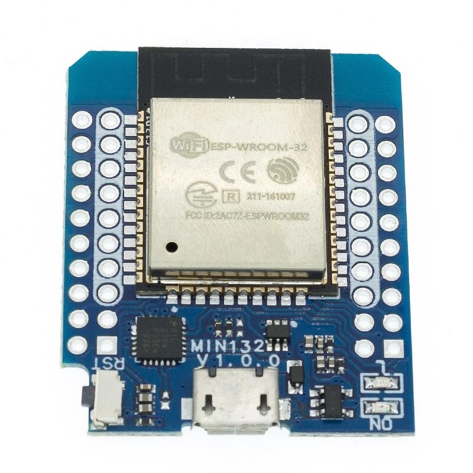

# 🛠️ Hob2Hood ESP32 Control System

📌 What is Hob2Hood?
Hob2Hood is an automation system that allows an induction hob (cooking top) to communicate wirelessly with a kitchen range hood. It controls the ventilation fan speed and lighting based on whatthe hob’s communicates to the hood — for example, turning on the fan and lights when cooking starts, or adjusting its speed as the heat increases.

4 relay board             |  ESP32 D1 mini
:-------------------------:|:-------------------------:
  |  

Some hobs and hoods support Hob2Hood natively (e.g. AEG, Electrolux), using infrared (IR) communication to transmit commands.
This project replicates and enhances that functionality using an ESP32, allowing:
Manual or IR-based fan/light control\
OTA (Over-The-Air) firmware updates\
Web-based control interface\

🚀 What This Program Does
This firmware is running on an ESP32:
Listens to IR commands using the RMT peripheral
Decodes DECODE_HASH - format signals. This is a native IRRemote library protocol that works with Hob2Hood.
Maps decoded signals to known Hob2Hood commands (Vent1–4, Light On/Off)
Controls output GPIO pins that switch relays connected to:\
Fan speed relays (Vent1–4)\
Light switch\
Hosts a web interface which has a serial input where commands can be typed in (via SerialHTML)\
These real-time command reception works via WebSocket\
Supports OTA updates, with IR and SerialHTML safely paused during update\
Implements a watchdog timer for reliability

🔌 Wiring / Pinout (ESP32 to Hood)
Function ESP32 GPIO  
IR Receiver	    GPIO  5	Connect IR sensor OUT pin here\
Fan Speed (1)	GPIO 32	Level shifter FAN HIGH or LOW\
Fan Speed (2/3)	GPIO 27	Not used relay needs to be HIGH allways
Fan On/Off Ctrl	GPIO 19	Main ventilation power ON/OFF\
Light On/Off	GPIO 25	Relay to control hood light\
Built-in LED	GPIO  2	Status indicator\

All output pins drive relays to control hood ventilator and light.

🌐 Web Interface (SerialHTML)
Simple control page served by ESP32 to control Light and Vent speed via WebSocket.

🔧 Installation & Setup\
Ensure you have the following libraries installed:\

ESPAsyncWebServer\
AsyncTCP\
ArduinoOTA\
SerialHTML (custom or internal library)\
Connect to the ESP32's IP address shown in serial output after WiFi connection.\

⚙️ Special Features\
🔧 Modular structure: clean, well-organized functions.\
📡 OTA integrated safely to enable over the air updates (disables IR for robustness).\
🔄 Watchdog Timer (WDT) to ensure recovery from freezing/lockups.\
🌐 WiFi reconnect logic is lightweight and correct.\
📲 SerialHTML abstraction for WebSerial with realtime WebSocket control.\
📦 CommandQueue + xQueue usage is perfect for decoupling.\
🕹️ IR Task on separate core giving robustness and responsiveness.\

🧠 IR Code Mapping\
IR Code (Hex)	Function\
0xE208293C	Light ON\
0x24ACF947	Light OFF\
0xE3C01BE2	Ventilation 1\
0xD051C301	Ventilation 2\
0xC22FFFD7	Ventilation 3\
0xB9121B29	Ventilation 4\
0x055303A3	Ventilation OFF\

🧪 Debugging & Logs\
Open the Web Serial Monitor at ESP32Hob2Hood/serial\
IR signal decoding\
Fan/light command handling\
OTA state\
WiFi reconnection attempts\
Watchdog resets (if triggered)\
📸 Images
 Schematic / wiring diagram
 
 
 
 
 
 
 Screenshot of the web control page
 
 
 